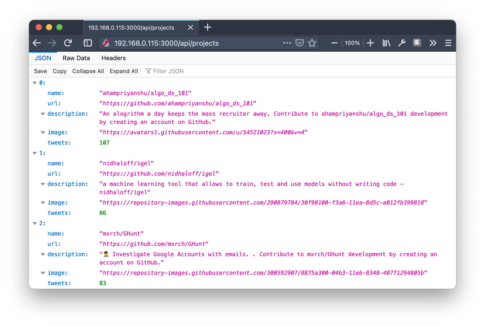

# githit



Find trending git repositories.
(Because GitHubs "Explore" tab is not good enough.)

This is in an very early stage, at the moment the API works, but it 
is not stable and there is no Frontend yet.

## Run the server
1) Install golang
2) Run the following:
```
go build
TWITTER_API_KEY=XXXX \
TWITTER_API_SECRET=XXXX \
TWITTER_ACCESS_TOKEN=XXXX \
TWITTER_ACCESS_TOKEN_SECRET=XXXX \
./githit
```
Of course you have to replace the tokens with the ones twitter provided you.

3) Open [localhost:3000/api/projects](http://localhost:3000/api/projects) in your browser

## How it works
This server listens to all tweets containing a GitHub or GitLab link and then 
shows you the repositories that were mentioned most.